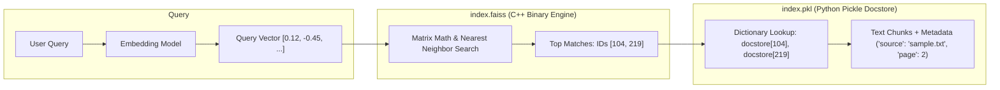
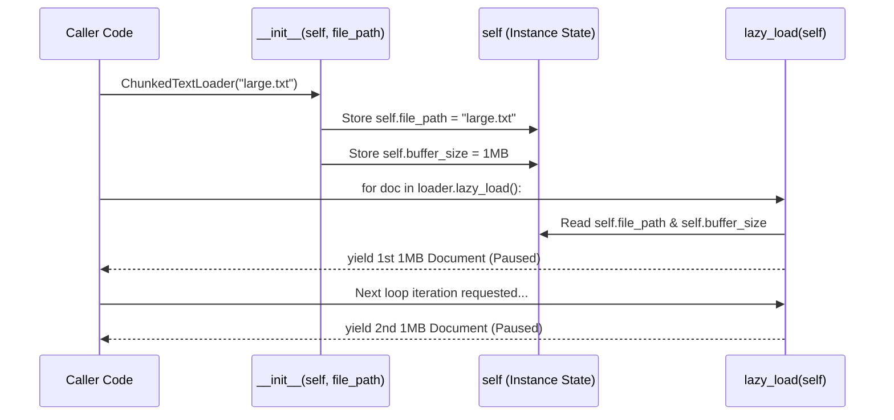

# Things You Did Not Know About Python & Local AI Systems

A collection of architectural nuances, Python runtime behaviors, and vector search mechanics discovered during the development of this project.

---

## 1. Python `import` Actually Executes the Whole File

### The Misconception
Many developers coming from compiled languages (C, C++, Java, Go) or TypeScript assume that `import module` or `from module import func` is just a symbol-table lookup or header declaration that loads function signatures.

### The Reality
**In Python, an `import` statement literally executes the entire target file from line 1 to the end.**

```python
# module_a.py
print("This line runs during import!")

def my_func():
    return 42

# If this isn't guarded, it fires whenever ANY file imports module_a:
expensive_setup_task()
```

When another file runs:
```python
# main.py
from module_a import my_func
```
Python pauses `main.py`, runs `module_a.py` top-to-bottom, prints the message, calls `expensive_setup_task()`, creates the function object for `my_func`, and only then returns to `main.py`.

---

## 2. The Purpose of `if __name__ == "__main__":`

Because importing executes files, Python needed a way for a single file to have a **dual identity**:
1. **As an executable CLI script**: You can run it directly (`python vector_store.py`).
2. **As a reusable library/module**: Other scripts can import its functions without triggering side effects.

### How Python Differentiates:
Python assigns a special internal variable called `__name__` to every module:

| Invocation Method | Value of `__name__` | `if __name__ == "__main__":` |
| :--- | :--- | :--- |
| Direct Execution (`python vector_store.py`) | `"__main__"` | **Runs** (Condition is `True`) |
| Imported by another file (`import vector_store`) | `"vector_store"` | **Skipped** (Condition is `False`) |

Without this guard, importing a vector store helper into your UI or API would re-read all documents, re-chunk them, and re-embed them against Gemini every time the server started!

---

## 3. FAISS: An In-Memory Math Engine, Not a Database Server

### The Misconception
When people hear "Vector Database", they expect a database daemon running on a port (like MySQL on `3306` or TiDB) with schemas, connection pools, and network listeners.

### The Reality
FAISS (**F**acebook **A**I **S**imilarity **S**earch) is not a database server. It is an **embedded in-memory C++ library** with Python bindings.

Think of it like the **SQLite of Vector Search**:
- **MySQL / TiDB / Qdrant / Milvus**: Client-server services with network listeners, users, access controls, and background daemons.
- **SQLite / FAISS**: Embedded libraries that operate directly inside your application process and persist to local flat files.

Despite being a flat-file library, FAISS was engineered by Meta AI to perform similarity search across **hundreds of millions to billions of vectors** using GPU acceleration (CUDA) and vector quantization (IVF-PQ).

---

## 4. Why FAISS Saves Two Files: `index.faiss` and `index.pkl`

FAISS itself is purely a mathematical search engine. It understands raw arrays of floats (`[0.012, -0.954, ...]`) and integer IDs (`0, 1, 2...`). **FAISS has no concept of text strings, file paths, or JSON metadata.**

To build a full vector store, LangChain bridges this gap by saving two synchronized files:

```
faiss_db/
├── index.faiss   <-- The Math / Vector Index
└── index.pkl     <-- The Python Docstore & Metadata Map
```

### How the Two Files Work Together:



1. **`index.faiss`**: Contains the compiled C++ binary vector index. It stores the raw coordinate arrays, quantization tables, and Voronoi cell centroids. It outputs matching integer IDs.
2. **`index.pkl`**: A serialized Python dictionary (`docstore`). It maps each integer ID to its corresponding text chunk, character positions, and document metadata.

### The Black-Box Summary (The "Coat-Check" Model)

If you view the system as a simplified black box, here is exactly how the data is split:

| File | What it contains under the hood | Black-Box Mental Model |
| :--- | :--- | :--- |
| **`index.faiss`** | Pure float arrays + integer IDs | `{ID: [0.024, -0.015, 0.089, ...]}` (Pure Math) |
| **`index.pkl`** | Python dictionary (`docstore`) | `{ID: "The actual English text chunk..."}` (Readable Text) |

#### What happens during a search:
1. **Query $\rightarrow$ Vector**: Your query *"Who made Python?"* is converted into a vector.
2. **`.faiss` finds the ID**: FAISS runs vector math and declares: *"The closest vector is **ID 42**!"* *(FAISS does not know what text is inside ID 42).*
3. **`.pkl` retrieves the text**: LangChain passes **ID 42** into the `.pkl` dictionary, which retrieves the actual text: *"Python was created by Guido van Rossum."*

---

## 5. What Is `.pkl` (Python Pickle) & Why Does It Warn About Security?

A `.pkl` file is produced by Python’s native `pickle` module. 

### What it does:
Pickle takes nearly any Python object in memory (dictionaries, custom class instances, lists) and serializes it into a byte stream on disk.

### The Hidden Catch:
When loading FAISS in LangChain, you must explicitly pass:
```python
FAISS.load_local(..., allow_dangerous_deserialization=True)
```
Why is it labeled "dangerous"?
`pickle` does not just store static data like JSON does; it stores the instructions to reconstruct Python objects. If an attacker tampers with a `.pkl` file or you download an unknown `.pkl` file from the internet, loading it can execute arbitrary system commands (`os.system("rm -rf /")`) on your machine. For trusted local files you generated yourself, it is safe.

---

## 6. Eager vs. Lazy Loading in Ingestion Pipelines (`load()` vs. `lazy_load()`)

### The Misconception
Many developers think `lazy_load()` means: *"The file is only loaded when a user sends a prompt into the chatbot."*

### The Reality: Ingestion vs. Query Time
1. **At Query Time (`app.py`)**: Neither `loader.load()` nor `loader.lazy_load()` is ever executed! The chatbot queries the pre-built FAISS index on disk (`index.faiss` and `index.pkl`) and retrieves only the top-$k$ relevant chunks.
2. **At Ingestion Time (`vector_store.py`)**: This is the only phase where loaders run. The choice between `load()` and `lazy_load()` is purely an **ingestion-time memory management decision**.

---

### Eager Loading (`loader.load()`): High RAM, Simple
* **Mechanism**: Reads all target files/pages into a single Python `list` in RAM simultaneously.
* **Problem at Scale**: If you have 50,000 PDFs or 100 GB of text, storing all document objects in RAM at once will cause Python to crash with a fatal `MemoryError` (OOM - Out of Memory).

```python
# ❌ All 50,000 files read into RAM at once:
documents = loader.load()
```

---

### Lazy Loading (`loader.lazy_load()`): Constant Low RAM, Streaming
* **Mechanism**: Uses a Python **generator** (`yield`). It loads one document or page into RAM, lets you process it, and discards it before loading the next.
* **Result**: Memory consumption remains flat (e.g., 50 MB) whether ingesting 5 documents or 5,000,000 documents.

```python
# ✅ Only one document/page in RAM at a time:
for doc in loader.lazy_load():
    chunks = text_splitter.split_documents([doc])
    vector_store.add_documents(chunks)
    # The previous doc is dropped and reclaimed by Python's Garbage Collector!
```

---

### How Python Automatically Discards the Processed Document

In Python, memory cleanup is driven by **Reference Counting & Garbage Collection**:
1. When `for doc in loader.lazy_load():` advances to the next iteration, the variable `doc` is rebound to the new document.
2. Because no other active variables point to the old document object, its reference count drops to **0**.
3. Python's memory manager immediately reclaims that memory block for reuse or returns it to the operating system.

---

### Can We Control How Much of the File is Loaded?

**Yes.** Granular control exists at three architectural layers:

1. **Loader-Level Granularity (What the loader yields)**:
   * **`PyPDFLoader.lazy_load()`**: Yields **one page** at a time.
   * **`DirectoryLoader.lazy_load()`**: Yields **one file** at a time.
   * **`CSVLoader.lazy_load()`**: Yields **one row** at a time.

2. **Custom Python Chunking / Slicing (Byte or Line Level)**:
   If a single text file is huge (e.g., a 20 GB log file or database dump), even reading one full file at a time can overflow RAM. You can write a generator that reads a fixed buffer or line slice:
   ```python
   def read_in_chunks(file_path, chunk_size_bytes=1024 * 1024):  # 1 MB buffer at a time
       with open(file_path, "r", encoding="utf-8") as f:
           while True:
               data = f.read(chunk_size_bytes)
               if not data:
                   break
               yield Document(page_content=data, metadata={"source": file_path})
   ```

3. **Embedding Batch Sizes (`batch_size`)**:
   When pushing split chunks to vector databases and embedding APIs (e.g., Google Gemini or OpenAI), you control how many chunks are sent per network request:
   ```python
   vector_store.add_documents(chunks, batch_size=64)  # Embeds 64 chunks per API call
   ```

---

## 7. The "Pageless" Problem: Ingesting a 20 GB `.txt` File Without Crashing

### The Problem
* A PDF has natural page boundaries; `PyPDFLoader.lazy_load()` parses page by page, even within a single document.
* A plain `.txt` file **has no pages**.
* Default LangChain `TextLoader` calls `f.read()`, loading 100% of the file into RAM at once. On a 20 GB file, a standard 16 GB machine immediately crashes with a fatal `MemoryError`.

---

### The 3 Production Solutions

#### Solution 1: Line / Paragraph Streaming (Most Common & Cleanest)
In Python, iterating over a file with `for line in f:` does **not** read the entire file into RAM—it streams line-by-line from disk with virtually zero memory overhead. You can accumulate lines into a buffer and yield `Document` objects:

```python
from langchain_core.document_loaders import BaseLoader
from langchain_core.documents import Document

class StreamingTextLoader(BaseLoader):
    """Streams a giant .txt file line-by-line, yielding a Document every ~1000 characters."""
    def __init__(self, file_path: str, max_chars_per_doc: int = 1000):
        self.file_path = file_path
        self.max_chars_per_doc = max_chars_per_doc

    def lazy_load(self):
        with open(self.file_path, "r", encoding="utf-8") as f:
            buffer = ""
            for line in f:                     # Reads ONE line from disk at a time!
                buffer += line
                if len(buffer) >= self.max_chars_per_doc:
                    yield Document(page_content=buffer, metadata={"source": self.file_path})
                    buffer = ""                # Reset buffer -> RAM is freed immediately!
            
            # Leftover tail of file
            if buffer:
                yield Document(page_content=buffer, metadata={"source": self.file_path})
```
* **Memory footprint**: ~15 MB total RAM, whether the file is 10 MB or 100 GB.

#### Solution 2: Pre-splitting on Disk
If you prefer not to write custom streaming logic, split the file on disk into smaller parts (e.g. 50,000 lines each) before ingestion:
```powershell
# Windows PowerShell example:
$i = 0; Get-Content huge_20gb.txt -ReadCount 50000 | ForEach-Object {
    $_ | Out-File "data/part_$i.txt"
    $i++
}
```
Then use LangChain's built-in `DirectoryLoader`:
```python
loader = DirectoryLoader("data/", glob="part_*.txt", loader_cls=TextLoader)
```

#### Solution 3: Memory-Mapped Files (`mmap`)
Python's native `mmap` module maps a disk file directly into the application's virtual address space, letting the OS kernel page small memory blocks from SSD on demand:
```python
import mmap

with open("huge_20gb.txt", "r+b") as f:
    with mmap.mmap(f.fileno(), length=0, access=mmap.ACCESS_READ) as mm:
        while chunk := mm.read(1024 * 1024):  # Read 1 MB at a time
            text = chunk.decode("utf-8", errors="ignore")
            # Process Document...
```

---

## 8. Python OOP Demystified: `class`, `__init__`, `self`, and `yield`

When creating custom loaders or extensions in LangChain, Python Object-Oriented Programming (OOP) syntax is central.

```python
from langchain_core.document_loaders import BaseLoader
from langchain_core.documents import Document

class ChunkedTextLoader(BaseLoader):
    """Custom LangChain loader that streams a giant file in 1 MB slices."""
    def __init__(self, file_path: str, buffer_size: int = 1024 * 1024):
        self.file_path = file_path
        self.buffer_size = buffer_size

    def lazy_load(self):
        with open(self.file_path, "r", encoding="utf-8") as f:
            while True:
                data = f.read(self.buffer_size)
                if not data:
                    break
                yield Document(page_content=data, metadata={"source": self.file_path})
```

---

### Concept Breakdown

| Syntax | What It Means | Real-World Mental Model |
| :--- | :--- | :--- |
| **`class ChunkedTextLoader`** | The **Blueprint** | A cookie cutter. It is not the cookie itself, but the template used to make cookies. |
| **`(BaseLoader)`** | **Inheritance** | Tells Python: *"Build this class on top of LangChain's `BaseLoader` so all LangChain tools recognize it as an official loader."* |
| **`def __init__(self, ...)`** | **The Constructor** | The setup function that executes **automatically** the instant you create an object (`loader = ChunkedTextLoader(...)`). |
| **`self`** | **"Myself" / The Object's Backpack** | The specific instance being created. It allows an object to store data inside its own personal memory space. |
| **`self.file_path = file_path`** | **Attaching State** | `file_path` on the right is a temporary parameter that vanishes after `__init__`. Storing it on `self.file_path` keeps it alive inside the object's backpack. |
| **`def lazy_load(self):`** | **Instance Method** | A method on the object. Because it accepts `self`, it can reach into its backpack and use `self.file_path` and `self.buffer_size`. |
| **`yield` vs. `return`** | **Generator Pause vs. Termination** | `return` sends a final output and destroys local state. `yield` spits out **one item**, pauses the function right there, and resumes only when the next item is requested. |

---

### The Lifecycle Flowchart




