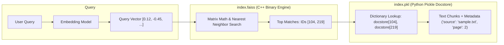

# Things You Did Not Know About Python & Local AI Systems

A collection of architectural nuances, Python runtime behaviors, and vector search mechanics discovered during the development of this project.

---

## 1. Python `import` Actually Executes the Whole File

### The Misconception
Many developers coming from compiled languages (C, C++, Java, Go) or TypeScript assume that `import module` or `from module import func` is just a symbol-table lookup or header declaration that loads function signatures.

### The Reality
**In Python, an `import` statement literally executes the entire target file from line 1 to the end.**

```python
# module_a.py
print("This line runs during import!")

def my_func():
    return 42

# If this isn't guarded, it fires whenever ANY file imports module_a:
expensive_setup_task()
```

When another file runs:
```python
# main.py
from module_a import my_func
```
Python pauses `main.py`, runs `module_a.py` top-to-bottom, prints the message, calls `expensive_setup_task()`, creates the function object for `my_func`, and only then returns to `main.py`.

---

## 2. The Purpose of `if __name__ == "__main__":`

Because importing executes files, Python needed a way for a single file to have a **dual identity**:
1. **As an executable CLI script**: You can run it directly (`python vector_store.py`).
2. **As a reusable library/module**: Other scripts can import its functions without triggering side effects.

### How Python Differentiates:
Python assigns a special internal variable called `__name__` to every module:

| Invocation Method | Value of `__name__` | `if __name__ == "__main__":` |
| :--- | :--- | :--- |
| Direct Execution (`python vector_store.py`) | `"__main__"` | **Runs** (Condition is `True`) |
| Imported by another file (`import vector_store`) | `"vector_store"` | **Skipped** (Condition is `False`) |

Without this guard, importing a vector store helper into your UI or API would re-read all documents, re-chunk them, and re-embed them against Gemini every time the server started!

---

## 3. FAISS: An In-Memory Math Engine, Not a Database Server

### The Misconception
When people hear "Vector Database", they expect a database daemon running on a port (like MySQL on `3306` or TiDB) with schemas, connection pools, and network listeners.

### The Reality
FAISS (**F**acebook **A**I **S**imilarity **S**earch) is not a database server. It is an **embedded in-memory C++ library** with Python bindings.

Think of it like the **SQLite of Vector Search**:
- **MySQL / TiDB / Qdrant / Milvus**: Client-server services with network listeners, users, access controls, and background daemons.
- **SQLite / FAISS**: Embedded libraries that operate directly inside your application process and persist to local flat files.

Despite being a flat-file library, FAISS was engineered by Meta AI to perform similarity search across **hundreds of millions to billions of vectors** using GPU acceleration (CUDA) and vector quantization (IVF-PQ).

---

## 4. Why FAISS Saves Two Files: `index.faiss` and `index.pkl`

FAISS itself is purely a mathematical search engine. It understands raw arrays of floats (`[0.012, -0.954, ...]`) and integer IDs (`0, 1, 2...`). **FAISS has no concept of text strings, file paths, or JSON metadata.**

To build a full vector store, LangChain bridges this gap by saving two synchronized files:

```
faiss_db/
├── index.faiss   <-- The Math / Vector Index
└── index.pkl     <-- The Python Docstore & Metadata Map
```

### How the Two Files Work Together:



1. **`index.faiss`**: Contains the compiled C++ binary vector index. It stores the raw coordinate arrays, quantization tables, and Voronoi cell centroids. It outputs matching integer IDs.
2. **`index.pkl`**: A serialized Python dictionary (`docstore`). It maps each integer ID to its corresponding text chunk, character positions, and document metadata.

### The Black-Box Summary (The "Coat-Check" Model)

If you view the system as a simplified black box, here is exactly how the data is split:

| File | What it contains under the hood | Black-Box Mental Model |
| :--- | :--- | :--- |
| **`index.faiss`** | Pure float arrays + integer IDs | `{ID: [0.024, -0.015, 0.089, ...]}` (Pure Math) |
| **`index.pkl`** | Python dictionary (`docstore`) | `{ID: "The actual English text chunk..."}` (Readable Text) |

#### What happens during a search:
1. **Query $\rightarrow$ Vector**: Your query *"Who made Python?"* is converted into a vector.
2. **`.faiss` finds the ID**: FAISS runs vector math and declares: *"The closest vector is **ID 42**!"* *(FAISS does not know what text is inside ID 42).*
3. **`.pkl` retrieves the text**: LangChain passes **ID 42** into the `.pkl` dictionary, which retrieves the actual text: *"Python was created by Guido van Rossum."*

---

## 5. What Is `.pkl` (Python Pickle) & Why Does It Warn About Security?

A `.pkl` file is produced by Python’s native `pickle` module. 

### What it does:
Pickle takes nearly any Python object in memory (dictionaries, custom class instances, lists) and serializes it into a byte stream on disk.

### The Hidden Catch:
When loading FAISS in LangChain, you must explicitly pass:
```python
FAISS.load_local(..., allow_dangerous_deserialization=True)
```
Why is it labeled "dangerous"?
`pickle` does not just store static data like JSON does; it stores the instructions to reconstruct Python objects. If an attacker tampers with a `.pkl` file or you download an unknown `.pkl` file from the internet, loading it can execute arbitrary system commands (`os.system("rm -rf /")`) on your machine. For trusted local files you generated yourself, it is safe.
